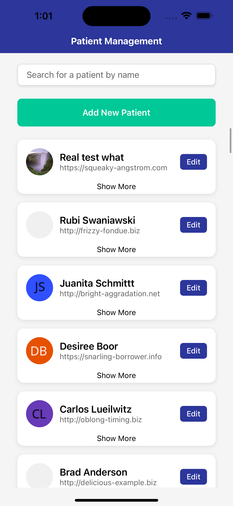
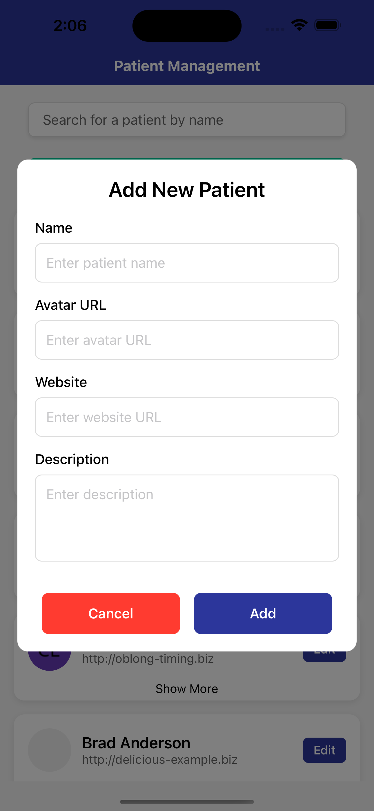
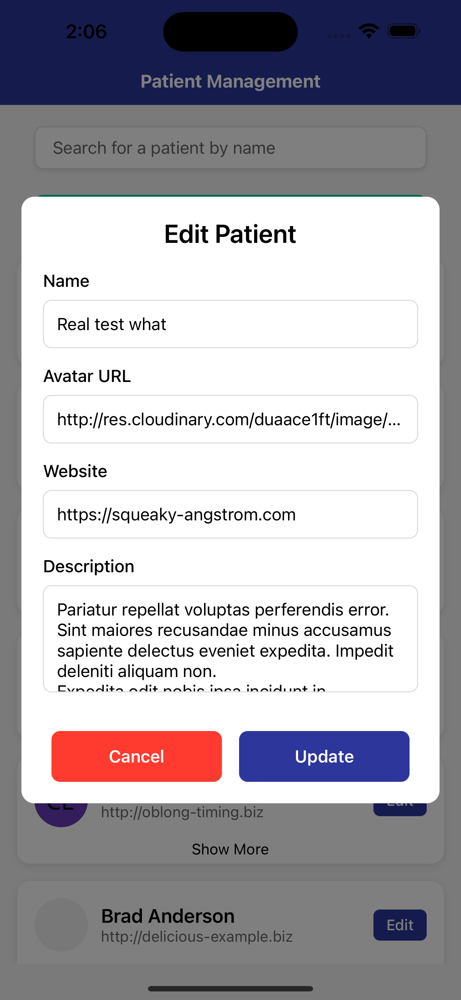

# Patient Manager App 

This React Native application, developed using Expo, demonstrates a patient management system.

<div style="display: flex; justify-content: space-between;">
  <div style="width: 30%; margin: 0 10px;"> 
  
  </div>
  <div style="width: 30%; margin: 0 10px;">
    <!--  -->
    

  </div>
  <div style="width: 30%; margin: 0 10px;">
    <!--  -->
    
  </div>
</div>

## Get started

You must install the app on an simulator (Android or iOS) before executing it. You can use Android Studio to download an Android simulator or Xcode to download an iPhone simulator. 

1. Install dependencies

   ```bash
   npx expo install
   ```

2. Start the app

   ```bash
    npx expo start
   ```

3. Select where to run the app by choosing the corresponding option: Android, iOS, or Web options a | i | w respectively. 

## Features:

1. **Retrieve Patient Records:** Fetches a list of patient records from the provided API.
1. **Display Patient Cards:** Displays each patient’s record individually in a user-friendly card format.
1. **Expand/Collapse Details:** Each card includes a button to expand or collapse additional patient details.
1. **Edit and Add Patients:** Users can edit existing patient data or add new patients to the list using a modal component.
1. **Form Validation:** Implements form validation to ensure the accuracy and completeness of patient data.
1. **Search Functionality:** A search bar is added to allow users to quickly find specific patients by name (added to improve usability).
1. **User Notifications:** Provides user-friendly notifications for successful or failed data modifications.
1. **Interactive Design:** Ensures the application is responsive and interactive.

## Known Issues:
- Some patients' avatar icons, which use their initials as a placeholder, display a gray background color instead of showing the initials. This appears to be an inconsistency in rendering.
- The list does not use persistent data storage, meaning patient information resets after the app is closed.

## Design Considerations:
- **Search Bar:** I implemented the search functionality to enable users to quickly locate specific patients, improving overall usability.
- **Avatar Customization:** Patient cards include avatar icons. When no avatar image is available, initials are displayed as placeholders for better visual identification.

## Improvements

This section outlines potential improvements for future development:

*   **Avatar URL Management:** The application currently uses hardcoded URLs for generating avatars. These URLs should be moved to a `.env` file for better security and maintainability. This will allow for easier configuration and prevent sensitive information from being exposed in the codebase.

*   **Code Encapsulation:** Some logic within the `index.tsx` files could be further encapsulated into separate modules or utility functions within a dedicated directory (e.g., `services`). This would improve code organization, readability, and maintainability by making the file cleaner and more focused on composition.

*   **Controlled Scrolling for Lazy Loading Demonstration:** The current implementation might load a large number of patients at once, making it difficult to observe the effects of lazy loading. Limiting the initial number of patients loaded and implementing proper pagination or infinite scrolling would better demonstrate the benefits of lazy loading.

    *   **Implementation suggestions:**
        1.  Implement pagination on the backend to fetch patients in smaller chunks.
        1.  Use a library or implement custom logic to detect when the user has scrolled near the bottom of the list.
        1.  Fetch the next set of patients when the scroll threshold is reached.

By addressing these points, the application's codebase will become more robust, maintainable, and efficient.